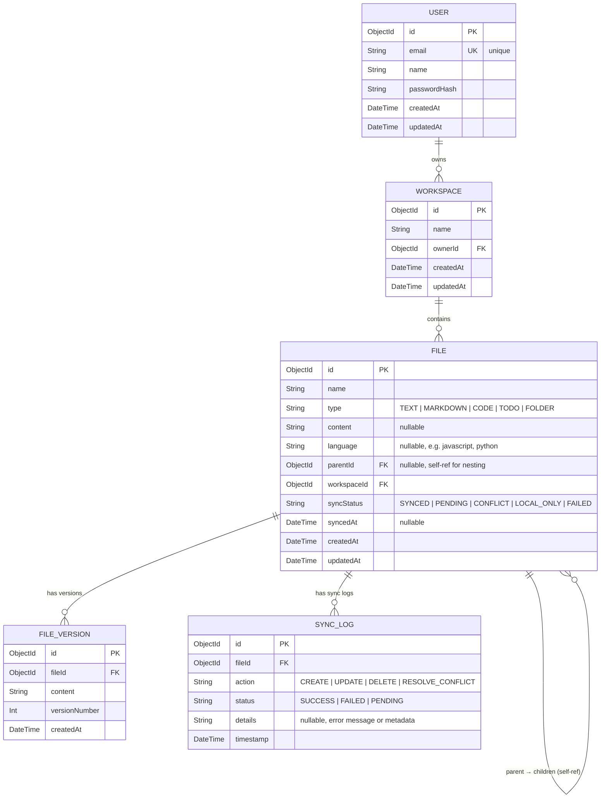

# 🗄️ SafarSetu Pro — ER Diagram (Database Design)

## Entity Relationship Diagram



---

## Prisma Schema (MongoDB)

```prisma
datasource db {
  provider = "mongodb"
  url      = env("DATABASE_URL")
}

generator client {
  provider = "prisma-client-js"
}

model User {
  id           String      @id @default(auto()) @map("_id") @db.ObjectId
  email        String      @unique
  name         String
  passwordHash String
  workspaces   Workspace[]
  createdAt    DateTime    @default(now())
  updatedAt    DateTime    @updatedAt
}

model Workspace {
  id        String   @id @default(auto()) @map("_id") @db.ObjectId
  name      String
  owner     User     @relation(fields: [ownerId], references: [id], onDelete: Cascade)
  ownerId   String   @db.ObjectId
  files     File[]
  createdAt DateTime @default(now())
  updatedAt DateTime @updatedAt

  @@index([ownerId])
}

model File {
  id          String        @id @default(auto()) @map("_id") @db.ObjectId
  name        String
  type        String        // TEXT, MARKDOWN, CODE, TODO, FOLDER
  content     String?       @default("")
  language    String?       // javascript, python, html, css, json, etc.
  parentId    String?       @db.ObjectId
  workspace   Workspace     @relation(fields: [workspaceId], references: [id], onDelete: Cascade)
  workspaceId String        @db.ObjectId
  syncStatus  String        @default("LOCAL_ONLY")
  syncedAt    DateTime?
  versions    FileVersion[]
  syncLogs    SyncLog[]
  createdAt   DateTime      @default(now())
  updatedAt   DateTime      @updatedAt

  @@index([workspaceId])
  @@index([parentId])
  @@index([syncStatus])
}

model FileVersion {
  id            String   @id @default(auto()) @map("_id") @db.ObjectId
  file          File     @relation(fields: [fileId], references: [id], onDelete: Cascade)
  fileId        String   @db.ObjectId
  content       String
  versionNumber Int
  createdAt     DateTime @default(now())

  @@index([fileId])
}

model SyncLog {
  id        String   @id @default(auto()) @map("_id") @db.ObjectId
  file      File     @relation(fields: [fileId], references: [id], onDelete: Cascade)
  fileId    String   @db.ObjectId
  action    String   // CREATE, UPDATE, DELETE, RESOLVE_CONFLICT
  status    String   // SUCCESS, FAILED, PENDING
  details   String?
  timestamp DateTime @default(now())

  @@index([fileId])
  @@index([status])
}
```

---

## Table Details

### USER
The account table. Each user can own multiple workspaces.

| Column | Type | Constraints | Description |
|---|---|---|---|
| id | ObjectId | PK, auto | Unique identifier |
| email | String | Unique | Login email |
| name | String | Required | Display name |
| passwordHash | String | Required | bcrypt hashed password |
| createdAt | DateTime | Auto | Account creation time |
| updatedAt | DateTime | Auto | Last update time |

---

### WORKSPACE
A container for files. Each user can have multiple workspaces (e.g., "Travel Notes", "Code Projects").

| Column | Type | Constraints | Description |
|---|---|---|---|
| id | ObjectId | PK, auto | Unique identifier |
| name | String | Required | Workspace name |
| ownerId | ObjectId | FK → User | Owner reference |
| createdAt | DateTime | Auto | Creation time |
| updatedAt | DateTime | Auto | Last update time |

---

### FILE
The central entity. Stores files AND folders (type = "FOLDER"). Uses self-referencing `parentId` for nesting.

| Column | Type | Constraints | Description |
|---|---|---|---|
| id | ObjectId | PK, auto | Unique identifier |
| name | String | Required | File/folder name |
| type | String | Required | TEXT, MARKDOWN, CODE, TODO, FOLDER |
| content | String | Nullable | File content (null for folders) |
| language | String | Nullable | Programming language (for CODE type) |
| parentId | ObjectId | FK → File, Nullable | Parent folder (null = root) |
| workspaceId | ObjectId | FK → Workspace | Workspace this belongs to |
| syncStatus | String | Default: LOCAL_ONLY | SYNCED, PENDING, CONFLICT, LOCAL_ONLY, FAILED |
| syncedAt | DateTime | Nullable | Last successful sync time |
| createdAt | DateTime | Auto | Creation time |
| updatedAt | DateTime | Auto | Last edit time |

**Key Indexes:**
- `workspaceId` — fast tree queries
- `parentId` — fast child lookups
- `syncStatus` — fast pending-sync queries

---

### FILE_VERSION
Stores snapshots of file content for undo/history functionality.

| Column | Type | Constraints | Description |
|---|---|---|---|
| id | ObjectId | PK, auto | Unique identifier |
| fileId | ObjectId | FK → File | File this version belongs to |
| content | String | Required | Content snapshot |
| versionNumber | Int | Required | Incrementing version number |
| createdAt | DateTime | Auto | When snapshot was taken |

**Key behavior:**
- A new version is created every 5 minutes during editing
- Also created when restoring a previous version
- Enables "time travel" through file history

---

### SYNC_LOG
Audit trail for all synchronization events.

| Column | Type | Constraints | Description |
|---|---|---|---|
| id | ObjectId | PK, auto | Unique identifier |
| fileId | ObjectId | FK → File | File that was synced |
| action | String | Required | CREATE, UPDATE, DELETE, RESOLVE_CONFLICT |
| status | String | Required | SUCCESS, FAILED, PENDING |
| details | String | Nullable | Error message or metadata |
| timestamp | DateTime | Auto | When sync occurred |

---

## Relationships Summary

| Relationship | Type | Description |
|---|---|---|
| User → Workspace | One-to-Many | A user owns many workspaces |
| Workspace → File | One-to-Many | A workspace contains many files |
| File → File | Self-referencing (One-to-Many) | A folder contains child files/folders |
| File → FileVersion | One-to-Many | A file has many version snapshots |
| File → SyncLog | One-to-Many | A file has many sync log entries |

---

## IndexedDB Schema (Client-Side Mirror)

The frontend maintains a local mirror in IndexedDB with the same structure:

```typescript
// IndexedDB stores (mirrors of MongoDB collections)
const DB_SCHEMA = {
  name: 'safarsetu-pro',
  version: 1,
  stores: {
    workspaces: {
      keyPath: 'id',
      indexes: ['name', 'syncStatus']
    },
    files: {
      keyPath: 'id',
      indexes: ['workspaceId', 'parentId', 'syncStatus', 'type']
    },
    fileVersions: {
      keyPath: 'id',
      indexes: ['fileId', 'versionNumber']
    },
    syncLogs: {
      keyPath: 'id',
      indexes: ['fileId', 'status', 'timestamp']
    }
  }
};
```

> **Note:** The IndexedDB schema is a simplified mirror of MongoDB. The `User` table is not stored locally — only a JWT token and basic profile info are cached in `localStorage`. All file data lives in IndexedDB for offline access.
