# 🏗️ SafarSetu Pro — Class Diagram (OOP Design)

## Complete Class Diagram

```mermaid
classDiagram
    direction TB

    %% ===== ENUMS =====
    class FileType {
        <<enumeration>>
        TEXT
        MARKDOWN
        CODE
        TODO
        FOLDER
    }

    class SyncStatus {
        <<enumeration>>
        SYNCED
        PENDING
        CONFLICT
        LOCAL_ONLY
        FAILED
    }

    class SyncAction {
        <<enumeration>>
        CREATE
        UPDATE
        DELETE
        RESOLVE_CONFLICT
    }

    %% ===== INTERFACES =====
    class IFileService {
        <<interface>>
        +create(data: CreateFileDTO) Promise~FileNode~
        +update(id: string, data: UpdateFileDTO) Promise~FileNode~
        +delete(id: string) Promise~void~
        +findById(id: string) Promise~FileNode~
        +getTree(workspaceId: string) Promise~FileNode[]~
        +getVersions(fileId: string) Promise~FileVersion[]~
        +restoreVersion(fileId: string, versionId: string) Promise~FileNode~
    }

    class ISyncService {
        <<interface>>
        +queueChange(fileId: string, action: SyncAction) Promise~void~
        +pushChanges() Promise~SyncResult~
        +pullChanges(since: Date) Promise~FileNode[]~
        +resolveConflict(fileId: string, resolution: string) Promise~void~
        +getStatus() SyncStatusInfo
    }

    class IWorkspaceService {
        <<interface>>
        +create(data: CreateWorkspaceDTO) Promise~Workspace~
        +getAll(userId: string) Promise~Workspace[]~
        +delete(id: string) Promise~void~
    }

    class IAuthService {
        <<interface>>
        +register(data: RegisterDTO) Promise~AuthResult~
        +login(data: LoginDTO) Promise~AuthResult~
        +verifyToken(token: string) Promise~User~
    }

    %% ===== BASE CLASS =====
    class BaseEntity {
        <<abstract>>
        #id: string
        #createdAt: Date
        #updatedAt: Date
        +getId() string
        +getCreatedAt() Date
        +getUpdatedAt() Date
        +toJSON() object
        #validate() void*
    }

    %% ===== MODEL CLASSES =====
    class User {
        -email: string
        -name: string
        -passwordHash: string
        -workspaces: Workspace[]
        +getEmail() string
        +getName() string
        +getWorkspaces() Workspace[]
        +createWorkspace(name: string) Workspace
        +toJSON() object
        #validate() void
    }

    class Workspace {
        -name: string
        -ownerId: string
        -files: FileNode[]
        +getName() string
        +getOwnerId() string
        +getFiles() FileNode[]
        +getFileTree() FileNode[]
        +addFile(file: FileNode) void
        +removeFile(fileId: string) void
        +toJSON() object
        #validate() void
    }

    class FileNode {
        -name: string
        -type: FileType
        -content: string
        -language: string
        -parentId: string
        -workspaceId: string
        -syncStatus: SyncStatus
        -syncedAt: Date
        -versions: FileVersion[]
        -children: FileNode[]
        +getName() string
        +getType() FileType
        +getContent() string
        +getLanguage() string
        +getSyncStatus() SyncStatus
        +getChildren() FileNode[]
        +isFolder() boolean
        +updateContent(content: string) void
        +setSyncStatus(status: SyncStatus) void
        +createVersion() FileVersion
        +getVersionHistory() FileVersion[]
        +addChild(node: FileNode) void
        +toJSON() object
        #validate() void
    }

    class FileVersion {
        -fileId: string
        -content: string
        -versionNumber: number
        +getFileId() string
        +getContent() string
        +getVersionNumber() number
        +toJSON() object
        #validate() void
    }

    class SyncLog {
        -fileId: string
        -action: SyncAction
        -status: string
        -details: string
        +getFileId() string
        +getAction() SyncAction
        +getStatus() string
        +markSuccess() void
        +markFailed(error: string) void
        +toJSON() object
        #validate() void
    }

    %% ===== SERVICE CLASSES =====
    class FileService {
        -prisma: PrismaClient
        +create(data: CreateFileDTO) Promise~FileNode~
        +update(id: string, data: UpdateFileDTO) Promise~FileNode~
        +delete(id: string) Promise~void~
        +findById(id: string) Promise~FileNode~
        +getTree(workspaceId: string) Promise~FileNode[]~
        +getVersions(fileId: string) Promise~FileVersion[]~
        +restoreVersion(fileId: string, versionId: string) Promise~FileNode~
        -buildTree(files: FileNode[]) FileNode[]
        -deleteRecursive(id: string) Promise~void~
    }

    class SyncService {
        -prisma: PrismaClient
        -fileService: FileService
        +queueChange(fileId: string, action: SyncAction) Promise~void~
        +pushChanges() Promise~SyncResult~
        +pullChanges(since: Date) Promise~FileNode[]~
        +resolveConflict(fileId: string, resolution: string) Promise~void~
        +getStatus() SyncStatusInfo
        -detectConflicts(local: FileNode, cloud: FileNode) boolean
        -createSyncLog(fileId: string, action: SyncAction) Promise~void~
    }

    class WorkspaceService {
        -prisma: PrismaClient
        +create(data: CreateWorkspaceDTO) Promise~Workspace~
        +getAll(userId: string) Promise~Workspace[]~
        +delete(id: string) Promise~void~
        +findById(id: string) Promise~Workspace~
    }

    class AuthService {
        -prisma: PrismaClient
        -jwtSecret: string
        +register(data: RegisterDTO) Promise~AuthResult~
        +login(data: LoginDTO) Promise~AuthResult~
        +verifyToken(token: string) Promise~User~
        -hashPassword(password: string) Promise~string~
        -comparePassword(password: string, hash: string) Promise~boolean~
        -generateToken(userId: string) string
    }

    %% ===== CONTROLLER CLASSES =====
    class FileController {
        -fileService: FileService
        +createFile(req: Request, res: Response) void
        +updateFile(req: Request, res: Response) void
        +deleteFile(req: Request, res: Response) void
        +getFile(req: Request, res: Response) void
        +getFileTree(req: Request, res: Response) void
        +getVersions(req: Request, res: Response) void
        +restoreVersion(req: Request, res: Response) void
    }

    class SyncController {
        -syncService: SyncService
        +pushChanges(req: Request, res: Response) void
        +pullChanges(req: Request, res: Response) void
        +getStatus(req: Request, res: Response) void
        +resolveConflict(req: Request, res: Response) void
    }

    class WorkspaceController {
        -workspaceService: WorkspaceService
        +create(req: Request, res: Response) void
        +getAll(req: Request, res: Response) void
        +delete(req: Request, res: Response) void
    }

    class AuthController {
        -authService: AuthService
        +register(req: Request, res: Response) void
        +login(req: Request, res: Response) void
        +getProfile(req: Request, res: Response) void
    }

    %% ===== FRONTEND CLASSES =====
    class LocalDatabase {
        -dbName: string
        -version: number
        -db: IDBDatabase
        +init() Promise~void~
        +getAll(store: string) Promise~any[]~
        +getById(store: string, id: string) Promise~any~
        +put(store: string, data: any) Promise~void~
        +delete(store: string, id: string) Promise~void~
        +query(store: string, index: string, value: any) Promise~any[]~
    }

    class ClientSyncEngine {
        -localDb: LocalDatabase
        -apiBaseUrl: string
        -isOnline: boolean
        -syncInterval: number
        +init() void
        +onOnline() void
        +onOffline() void
        +pushPendingChanges() Promise~void~
        +pullCloudChanges() Promise~void~
        +getPendingCount() Promise~number~
        +getLastSyncTime() Date
        -startListening() void
        -scheduleSyncCheck() void
    }

    %% ===== INHERITANCE =====
    BaseEntity <|-- User
    BaseEntity <|-- Workspace
    BaseEntity <|-- FileNode
    BaseEntity <|-- FileVersion
    BaseEntity <|-- SyncLog

    %% ===== INTERFACE IMPLEMENTATIONS =====
    IFileService <|.. FileService
    ISyncService <|.. SyncService
    IWorkspaceService <|.. WorkspaceService
    IAuthService <|.. AuthService

    %% ===== RELATIONSHIPS =====
    User "1" --> "*" Workspace : owns
    Workspace "1" --> "*" FileNode : contains
    FileNode "1" --> "*" FileVersion : has versions
    FileNode "1" --> "*" SyncLog : has logs
    FileNode "1" --> "*" FileNode : children (self-ref)
    FileNode --> FileType : type
    FileNode --> SyncStatus : syncStatus
    SyncLog --> SyncAction : action

    %% ===== DEPENDENCIES =====
    FileController --> FileService : uses
    SyncController --> SyncService : uses
    WorkspaceController --> WorkspaceService : uses
    AuthController --> AuthService : uses
    SyncService --> FileService : uses
    ClientSyncEngine --> LocalDatabase : uses
```



---

## Design Patterns Used

### 1. Abstract Base Class Pattern
`BaseEntity` is an abstract class providing common fields (`id`, `createdAt`, `updatedAt`) and a `toJSON()` method. All model classes inherit from it.

```typescript
abstract class BaseEntity {
  protected id: string;
  protected createdAt: Date;
  protected updatedAt: Date;

  abstract validate(): void;

  toJSON(): object {
    return { id: this.id, createdAt: this.createdAt, updatedAt: this.updatedAt };
  }
}
```

### 2. Interface Segregation
Each service has a clean interface (`IFileService`, `ISyncService`, etc.) that defines the contract. Controllers depend on interfaces, not concrete classes.

### 3. Dependency Injection
Controllers receive their service instances through constructor injection:

```typescript
class FileController {
  private fileService: FileService;

  constructor(fileService: FileService) {
    this.fileService = fileService;
  }
}
```

### 4. Composite Pattern
`FileNode` uses the composite pattern — folders contain children `FileNode[]`, allowing recursive tree traversal:

```typescript
class FileNode extends BaseEntity {
  private children: FileNode[] = [];

  isFolder(): boolean {
    return this.type === FileType.FOLDER;
  }

  addChild(node: FileNode): void {
    if (!this.isFolder()) throw new Error("Cannot add child to non-folder");
    this.children.push(node);
  }
}
```

### 5. Observer Pattern (Client Sync)
`ClientSyncEngine` listens to browser `online`/`offline` events and triggers sync automatically:

```typescript
class ClientSyncEngine {
  startListening(): void {
    window.addEventListener('online', () => this.onOnline());
    window.addEventListener('offline', () => this.onOffline());
  }
}
```

---

## Data Transfer Objects (DTOs)

```typescript
interface CreateFileDTO {
  name: string;
  type: FileType;
  workspaceId: string;
  parentId?: string;
  language?: string;
  content?: string;
}

interface UpdateFileDTO {
  name?: string;
  content?: string;
  syncStatus?: SyncStatus;
}

interface RegisterDTO {
  name: string;
  email: string;
  password: string;
}

interface LoginDTO {
  email: string;
  password: string;
}

interface AuthResult {
  token: string;
  user: User;
}

interface SyncResult {
  pushed: number;
  pulled: number;
  conflicts: number;
}

interface SyncStatusInfo {
  isOnline: boolean;
  pendingChanges: number;
  lastSyncedAt: Date | null;
}
```
