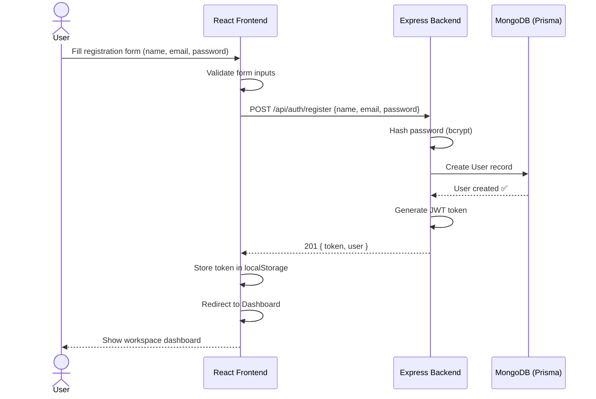
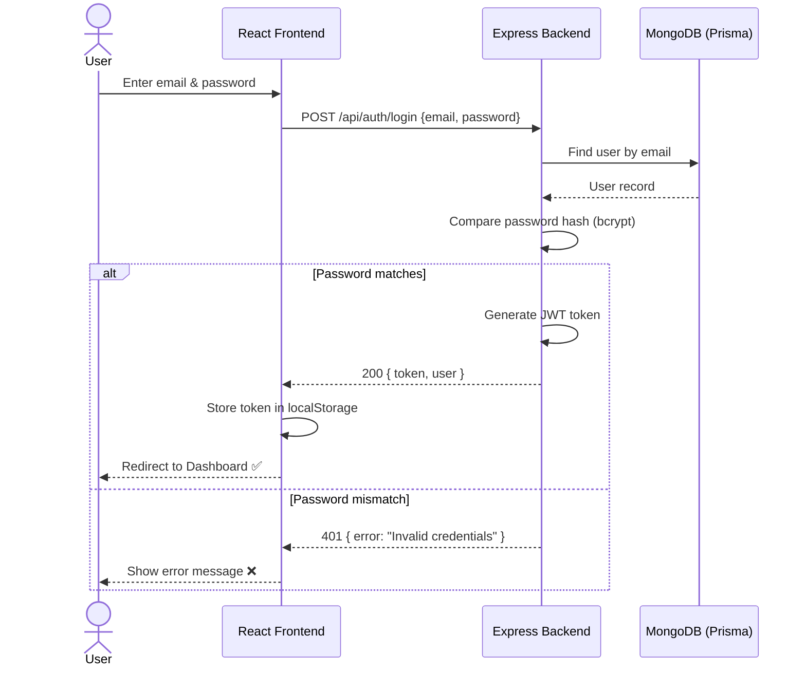
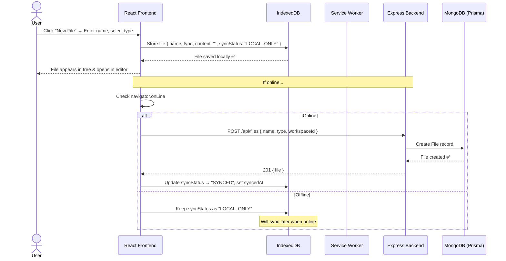
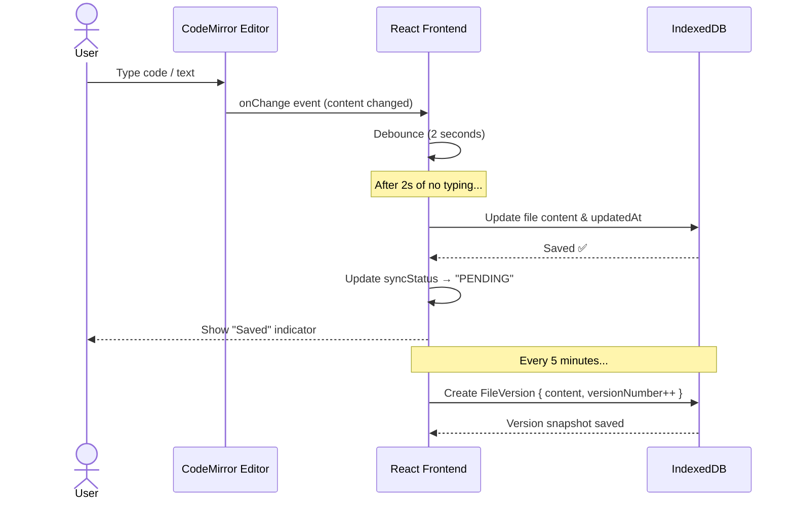
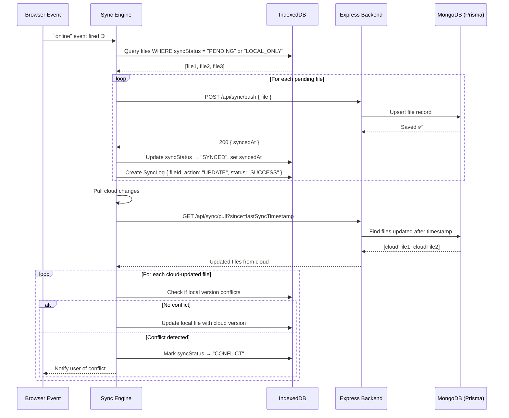
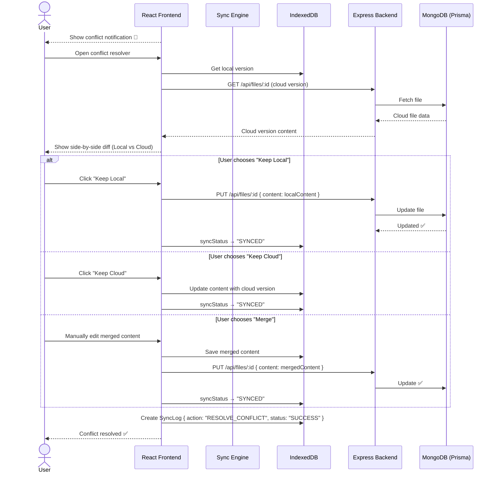
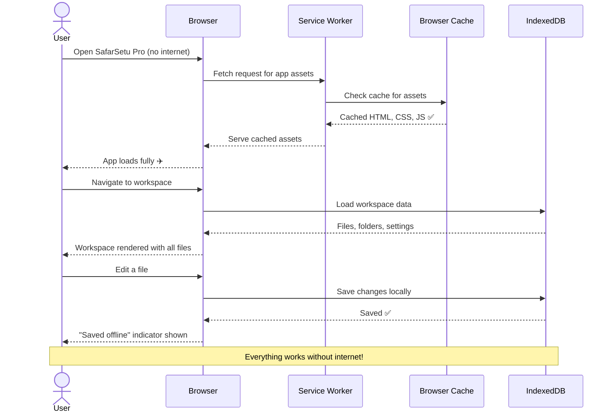
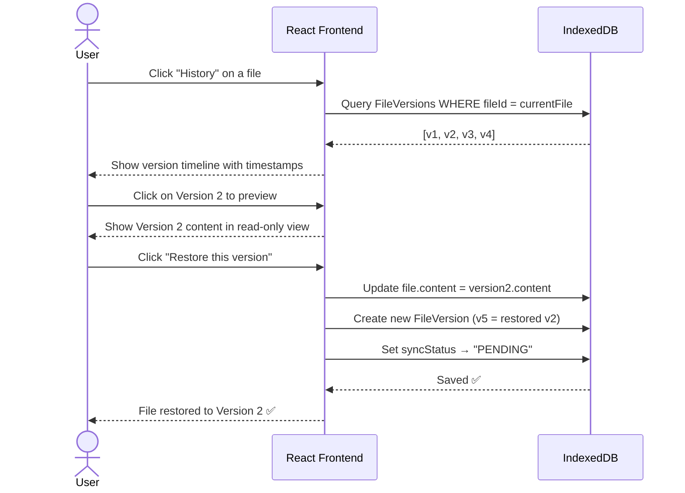
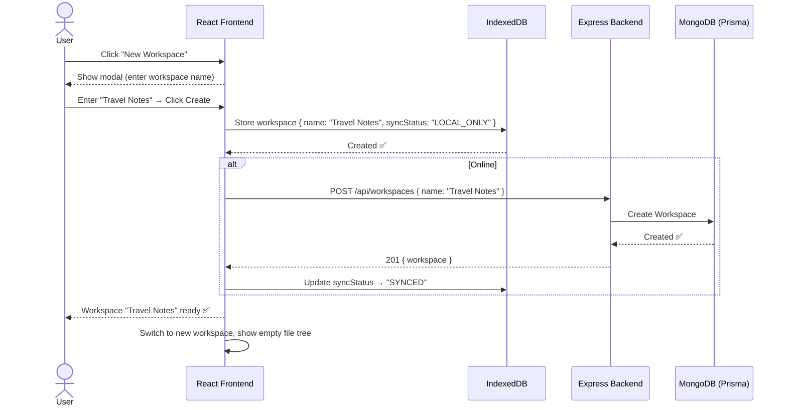

# 🔄 SafarSetu Pro — Sequence Diagrams

## 1. User Registration Flow

---

## 2. User Login Flow

---

## 3. Create File (Offline-First)

---

## 4. Edit File with Auto-Save

---

## 5. Auto Sync When Internet Returns

---

## 6. Conflict Resolution

---

## 7. Offline App Loading (Service Worker)

---

## 8. File Version Restore

---

## 9. Workspace Management

