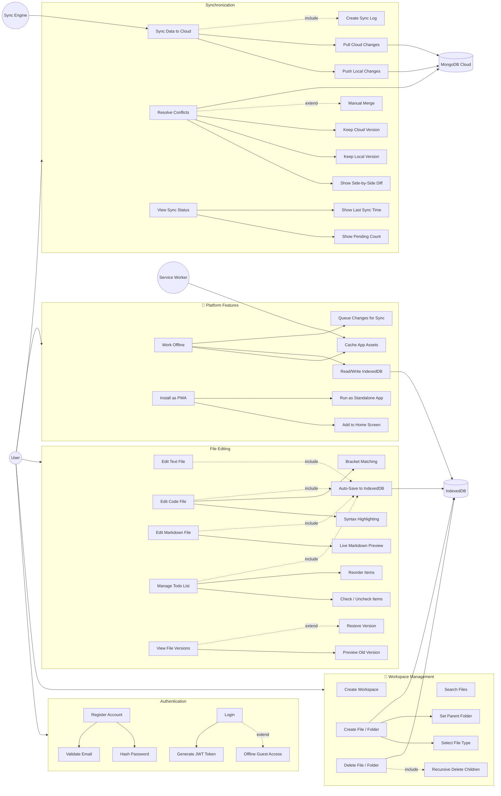

# 📋 SafarSetu Pro — Use Case Document

## Actors

| Actor | Description |
|---|---|
| **User** | A person who wants to write, code, or plan while traveling offline |
| **System** | SafarSetu Pro application (frontend + backend) |
| **IndexedDB** | Browser-based local database for offline storage |
| **MongoDB Cloud** | Remote cloud database for persistent storage & sync |
| **Service Worker** | Background process for caching and offline support |
| **Sync Engine** | Module that manages data synchronization between local and cloud |

---

## Use Case Diagram

### Diagram Legend

| Symbol | Meaning |
|---|---|
| `→` (solid arrow) | Direct relationship / includes |
| `-.->` (dashed arrow) | `<<include>>` or `<<extend>>` relationship |
| `((Actor))` | Actor (person or system) |
| `[(Database)]` | External data store |
| Subgraph boxes | Subsystem / module boundary |

---

## Detailed Use Cases

---

### UC-01: User Registration

| Field | Detail |
|---|---|
| **Actor** | User |
| **Precondition** | User has internet access |
| **Main Flow** | 1. User opens SafarSetu Pro → 2. Clicks "Sign Up" → 3. Enters name, email, password → 4. System validates and creates account in MongoDB → 5. User is logged in and redirected to dashboard |
| **Postcondition** | User account exists in database |
| **Alternative** | If email exists → show error "Account already exists" |

---

### UC-02: User Login

| Field | Detail |
|---|---|
| **Actor** | User |
| **Precondition** | User has an account |
| **Main Flow** | 1. User enters email/password → 2. System verifies credentials → 3. JWT token issued → 4. User redirected to workspace |
| **Postcondition** | User is authenticated with a session token |
| **Alternative** | If offline → allow access to locally cached workspace (guest mode) |

---

### UC-03: Create Workspace

| Field | Detail |
|---|---|
| **Actor** | User |
| **Precondition** | User is logged in |
| **Main Flow** | 1. User clicks "New Workspace" → 2. Enters workspace name → 3. System creates workspace in IndexedDB → 4. If online, also saved to MongoDB → 5. Workspace appears in sidebar |
| **Postcondition** | New workspace created locally (and optionally in cloud) |

---

### UC-04: Create File / Folder

| Field | Detail |
|---|---|
| **Actor** | User |
| **Precondition** | User has a workspace open |
| **Main Flow** | 1. User right-clicks in file tree or clicks "+" → 2. Selects file type (Text / Code / Markdown / Todo / Folder) → 3. Enters name → 4. System creates entry in IndexedDB → 5. File appears in tree → 6. If file, opens in editor |
| **Postcondition** | File/folder exists in IndexedDB with `syncStatus: LOCAL_ONLY` |

---

### UC-05: Edit Code File

| Field | Detail |
|---|---|
| **Actor** | User |
| **Precondition** | Code file is open in editor |
| **Main Flow** | 1. User types code in CodeMirror editor → 2. Syntax highlighting applied based on language → 3. Every 2 seconds, auto-save to IndexedDB (debounced) → 4. File version snapshot created every 5 minutes → 5. `syncStatus` set to `PENDING` |
| **Postcondition** | File content updated in IndexedDB with version history |

---

### UC-06: Edit Markdown File

| Field | Detail |
|---|---|
| **Actor** | User |
| **Precondition** | Markdown file is open |
| **Main Flow** | 1. User writes markdown in editor → 2. Live preview renders on the right panel → 3. Supports GFM (tables, task lists, code blocks) → 4. Auto-save to IndexedDB |
| **Postcondition** | Markdown content saved with rendered preview available |

---

### UC-07: Manage Todo List

| Field | Detail |
|---|---|
| **Actor** | User |
| **Precondition** | Todo file is open |
| **Main Flow** | 1. User adds todo item → 2. Checks/unchecks items → 3. Reorders items via drag → 4. Progress bar updates → 5. Auto-save to IndexedDB |
| **Postcondition** | Todo list persisted locally |

---

### UC-08: View File Version History

| Field | Detail |
|---|---|
| **Actor** | User |
| **Precondition** | File exists with versions |
| **Main Flow** | 1. User clicks "History" on a file → 2. System fetches all versions from IndexedDB → 3. Shows version list with timestamps → 4. User can preview any version → 5. User can restore a version |
| **Postcondition** | Previous version content can be viewed or restored |

---

### UC-09: Auto Sync to Cloud

| Field | Detail |
|---|---|
| **Actor** | System (Sync Engine) |
| **Precondition** | Internet connection detected (`navigator.onLine === true`) |
| **Main Flow** | 1. Sync Engine detects internet → 2. Queries IndexedDB for files with `syncStatus: PENDING` → 3. Pushes changes to Express API → 4. API saves to MongoDB via Prisma → 5. Updates `syncStatus` to `SYNCED` and `syncedAt` timestamp → 6. Creates SyncLog entry |
| **Postcondition** | All pending files synced to cloud |
| **Alternative** | If push fails → mark as `FAILED`, retry on next sync cycle |

---

### UC-10: Resolve Sync Conflict

| Field | Detail |
|---|---|
| **Actor** | User + System |
| **Precondition** | Same file edited both locally and on cloud |
| **Main Flow** | 1. During sync, system detects `localUpdatedAt > syncedAt` AND cloud version differs → 2. File marked as `CONFLICT` → 3. User shown diff of local vs cloud → 4. User chooses: Keep Local / Keep Cloud / Merge → 5. Chosen version saved and synced |
| **Postcondition** | Conflict resolved, file back to `SYNCED` |

---

### UC-11: Work Fully Offline

| Field | Detail |
|---|---|
| **Actor** | User |
| **Precondition** | App previously loaded (Service Worker cached assets) |
| **Main Flow** | 1. User opens app with no internet → 2. Service Worker serves cached UI → 3. All reads/writes go to IndexedDB → 4. User creates, edits, deletes files normally → 5. Offline badge shown in UI → 6. All changes queued for sync |
| **Postcondition** | Full functionality available offline; changes queued |

---

### UC-12: Install as PWA

| Field | Detail |
|---|---|
| **Actor** | User |
| **Precondition** | App visited in a supported browser |
| **Main Flow** | 1. Browser shows "Install" prompt → 2. User clicks install → 3. App added to home screen / dock → 4. Opens as standalone app (no browser chrome) |
| **Postcondition** | App installed as a native-like application |

---

### UC-13: Delete File / Folder

| Field | Detail |
|---|---|
| **Actor** | User |
| **Precondition** | File/folder exists |
| **Main Flow** | 1. User right-clicks file → "Delete" → 2. Confirmation dialog → 3. File removed from IndexedDB → 4. If folder, all children deleted recursively → 5. Delete action queued for sync |
| **Postcondition** | File removed locally, delete synced when online |

---

### UC-14: Search Files

| Field | Detail |
|---|---|
| **Actor** | User |
| **Precondition** | Workspace has files |
| **Main Flow** | 1. User types in search bar → 2. System searches file names in IndexedDB → 3. Matching files shown in dropdown → 4. User clicks to open |
| **Postcondition** | Target file opened in editor |
